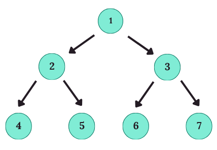

# Практикум №7 по Структури от данни, спец. ИС

## Какво е дърво?

***Дървото*** е йерархична структура от данни, съставена от **върхове** и **ръбове**. То започва с един основен връх, наречен **корен** (root), от който се разклоняват други върхове (наричани **деца**), образувайки по-малки поддървета.

### Основни термини и характеристики:
- **корен** (root): началният връх на дървото, който няма родител
- **връх** (node): всеки елемент в дървото
- **деца**: върховете, които са непосредствено свързани към даден връх
- **родител**: връх, който има деца
- **листо** (leaf): връх, който няма деца
- **вътрешен връх**: връх, който има поне едно дете и не е листо
- **поддърво**: множеството от върхове, което включва даден връх и всичките му наследници
- **височина на връх**: максималното разстояние от този връх до някое листо в неговото поддърво
- **дълбочина на връх**: разстоянието от този връх до корена на дървото
- **разклоненост**: максималният брой деца, които има който и да е връх в дървото

> **Note:** Нека `T` е дърво с корен `r`, и `v` е връх в `T`:
> - **Поддървото, вкоренено** във `v`, включва `v` и всички негови наследници  
> - **Височината** на `v` е максималното разстояние от `v` до някое листо в поддървото му  
> - **Дълбочината** на v е разстоянието от `v` до корена `r` на `T`

## Основни алгоритми за обхождане на двоично дърво  
**Обхождането** на дърво е процесът на посещаване на всеки връх в определен ред.
Съществуват два основни начина за обхождане на дървета:

### 1. Обхождане в дълбочина (DFS)
При **DFS** преминаваме на максимална дълбочина в поддървото, преди да се върнем към съседни възли на по-горно ниво.

**Сложност:** O(n), където n е броя на върховете в дървото.

Съществуват три основни типа обхождане в дълбочина:

#### 1.1 Префиксно обхождане (Preorder)
При префиксното обхождане винаги посещаваме текущия връх преди неговите деца. Коренът на дървото е първият връх, който се посещава. Започваме, като следваме пътя наляво, посещавайки всеки връх по реда на срещането му. Когато достигнем листо, се връщаме назад и продължаваме с дясната част на дървото, като отново посещаваме върховете в реда на срещането им.

Първо се обработва коренът, след това лявото поддърво и накрая дясното поддърво.  
**_Корен → Ляво поддърво → Дясно поддърво_**  

#### 1.2 Инфиксно обхождане (Inorder)
Първо се обработва лявото поддърво, след това коренът и накрая дясното поддърво.  
**_Ляво поддърво → Корен → Дясно поддърво_**

> **Забележка:** При двоичните дървета за търсене (**BST**) този тип обхождане извежда елементите в сортиран ред.

#### 1.3 Постфиксно обхождане (Postorder)
При постфиксното обхождане първо посещаваме децата на възела, преди да посетим самия него. Първо се обработва лявото поддърво, след това дясното поддърво и накрая коренът.  
**_Ляво поддърво → Дясно поддърво → Корен_**

### 2. Обхождане в ширoчина (BFS)
При **BFS** се преминава през възлите ниво по ниво, започвайки от корена и преминавайки към всяко следващо ниво. Изследват се всички възли на дадено ниво, преди да се премине към следващото ниво. Най-често се използва **опашка** (queue), за да се следи реда на върховете, които трябва да се посетят. Започваме от корена, добавяме го в опашката и след това последователно добавяме неговите деца, докато обработваме всеки връх.

**Сложност:** O(n), където n е броя на върховете в дървото.

## Задачи
[Линк към задачите](https://leetcode.com/problem-list/aw76m7ld/)
