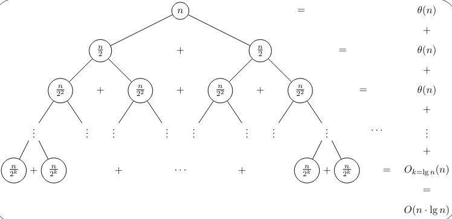
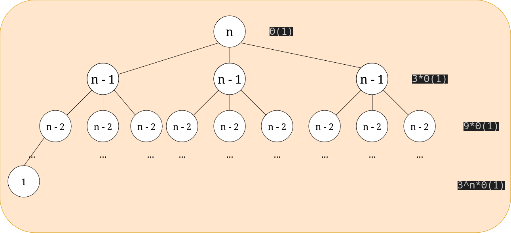
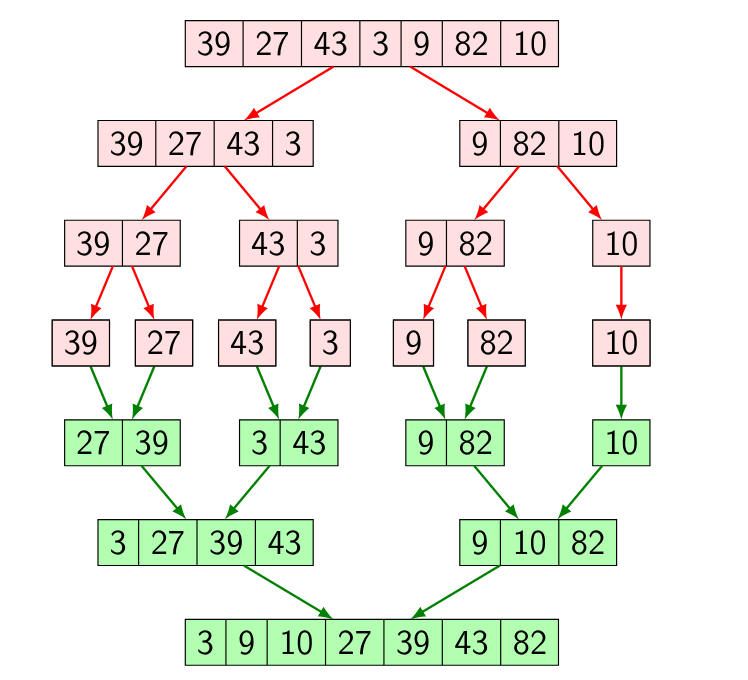
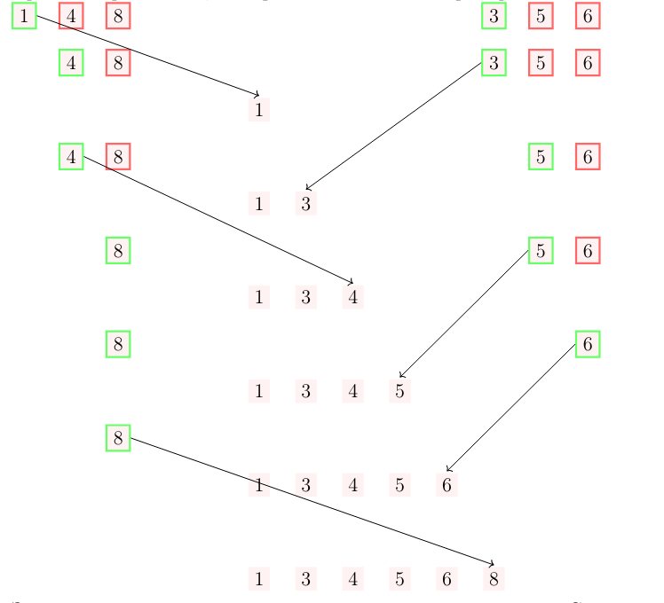

# Втори семинар по структури от данни - 17.10.2024

## Анализ на рекурсивни алгоритми.
В първи семинар разгледахме метод за анализиране на итеративни алгоритми. Този метод не работи когато анализираме рекурсивни алгоритми. За да намерим сложността на рекурсивен алгоритъм използваме рекурентни уравнения.

### Рекурентно уравнение
* Рекурентно уравнение е уравнение, което изразява общия член на някаква редица от числа чрез предишните членове.

Рекурентните уравнения описват рекурсивни алгоритми. Разбира се, както рекурсивните алгоритми имат дъно, така и рекурентните уравнения имат начални условия.

Нека разгледаме следния пример:
```cpp
void sum_rec(int* arr, unsigned size, int& sum)
{
    if(size == 0)
        return;
    
    sum += arr[0];
    
    return sum_rec(arr + 1, size - 1, sum);
}
```

Какво би било рекурентното уравнение, което описва този рекурсивен алгоритъм? Нека с променливата `n` означаваме големината на масива.

* Разглеждаме дъното. При n = 0 имаме Θ(1) работа.
* В противен случай, имаме едно добавяне и извикване на алгоритъма с вход `n - 1`.

Съставяме уравнението:
* T(0) = 1
* T(n) = T(n - 1) + 1

Решение на рекурентно уравнение наричаме затворена формула. Решение на горния пример би било:

T(n) = n + 1

## Методи за решаване на рекурентни уравнения

### 1. Чрез развиване
Винаги можем да започнем да развиваме рекурентното уравнение търсейки някаква закономерност.
$$
T(n) = T(n - 1) + \theta(1) = T(n - 2) + \theta(1) + \theta(1) = \newline
T(0) + \theta(1) + \dots + \theta(1) = \newline
(n + 1) * \theta(1) = \theta(n)
$$

### Чрез дърво на рекурсията
Всеки рекурсивен алгоритъм образува дърво на рекурсията. Разглеждайки броя върхове и работата, която се "извършва" във всеки връх, височината на дървото и т.н. можем да направим изводи за решението на рекурентната редица. 

Нека разгледаме следното рекурентно уравнение:
* T(0) = 1
* T(1) = 1
* T(n) = 2 * T(n / 2) + n

Това рекурентно уравнение описва работата на алгоритъмът `Merge Sort`, който ще разгледаме съвсем скоро. Как изглежда дървото на рекурсията?



Височината на това дърво е приблизително log(n). При стойност на параметъра `k = log_2(n)` стойността в листото е 1.
На всяко ниво имаме Θ(n) работа. Трябва да забележим, че работата за ниво j се смята по следната формула:
$$
2^j * \frac{\theta(n)}{2^j} = \theta(n)
$$ 

Това ще рече броят на върховете на всяко ниво умножен по работата, която се извършва във върха на дървото.

Щом броя на нивата е Θ(log(n)) а на всяко ниво се извършва Θ(n) работа, то търсената сложност е Θ(n log(n)).

### Други методи

## Примери
Нека разгледаме някои примери за рекурентни уравнения.
$$
T(0) = \theta(1)
\newline
T(n) = 3T(n - 1) + \theta(1)
$$

Дървото на рекурсията би изглеждало по следния начин:


Нивата на това дърво ще са n на брой. Всеки елемент е с единица по - малък от баща си. Също така, на всяко ниво има 3^j върха, където j е номерът на нивото (номерираме от 0). Всеки възел извършва Θ(1) работа. Сумираме по нива:

$$
\sum_{i = 0}^n 3^i * \theta(1) = \frac{3^{n + 1} - 1}{2} * \theta(1) = \theta(3^n)
$$

## Алгоритмична схема "разделяй и владей"
* Разделяй - Ако входът е достатъчно голям той се разделя на части и се преминава към стъпката **владей**. В противен случай (ако входът е достатъчно малък) задачата се решава по някакъв тривиален начин. (пример е дъното на рекурсията в `Merge Sort` където масив с големина 0 или 1 е тривиално сортиран.)
* Владей   - Пускаме алгоритъма върху всяка от частите и получаваме резултатите.
* Комбинирай - Използваме тези резултати за да получим желания от нас резултат.

## Алгоритъмът Merge Sort
Първо, нека се запознаем с функцията `merge`. Тя приема два сортирани масива и като резултат създава сортиран масив. Важно условие е масивите да са сортирани. Ако това не е така функцията не прави нищо логично.

Ако имаме масив с n елемента и успешно сортираме лявата и дясната половина, то извиквайки функцията `merge` ще получим желания сортиран масив. Но как да сортираме лявата и дясната половина?

Спомняме си, че пишем сортиращ алгоритъм. Извиквам mergeSort рекурсивно върху лявата и дясната половина на масива и след като ги сортира викаме функцията merge. mergeSort ще продължи да разбива масива на две, после левия и десния подмасив на още две и т.н.  

Масив от един елемент е сортиран и ще използваме този случай като дъно на рекурсията.

Нека разгледаме следната диаграма:


Оцветените в зелено клетки са подмасивите, на които вече е бил извикан merge.

Следната диаграма представя визуално как работи функцията `merge`:


Двата масива са сортирани, та има смисъл да гледаме единствено най - левите елементи. На всяка стъпка избираме по - малкия и го слагаме в резултатен масив. Трябва, разбира се, да се разгледа и случая в който масивите не са с равни дължини.

Сложността на `Merge Sort` се описва чрез рекурентната редица, използвана като пример за решение използващо метода с дърво на рекурсията. И в трита случая имаме Θ(n log(n))

Стабилен - Да

Адаптивен - Не

in-place - Не

Сложност по памет - Θ(n)

## Алгоритъмът Quick Sort