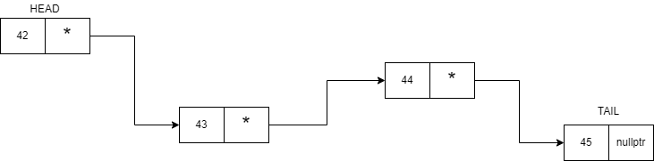
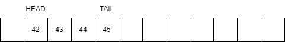

# Опашка
Опашката е линейна структура от данни, която работи на принципа FIFO (first in first out). Опашката отговаря точно на представата за реална опашка. 
Операции:
* Enqueue (или push) - добавя елемент в края на опашката
* Dequeue (или pop)  - премахва първия добавен елемент в опашката
* Front              - връща първия елемент в опашката
  
Опционални операции към интерфейса:
* empty() - Връща дали опашката е празна или не
* size()  - Връща размера на опашката

В STL имаме готова реализация на опашка. Тя се намира в библиотеката \<queue> и се създава чрез std::queue\<T>. 
Пример:
```cpp
#include<iostream>
#include<queue>

int main() {
    std::queue<int> q;

    q.push(1);
    q.push(2);
    q.push(3);
    q.push(4);

    std::cout << q.front();             // Извежда 1
    q.pop()                             // Премахва 1 от опашката
    std::cout << q.front();             // Извежда 2
    q.pop();                            // Премахва 2 от опашката
    q.pop();                            // Премахва 3 от опашката
}
```

## Приложения
Едно от основните приложения на опашката е използването ѝ в различни алгоритми за обхождане на графи, като най - ясен пример за това би бил алгоритъма BFS. Други алгоритми върху графи също използват опашка (или нейни разновидности) за да обхождат графа и да решават различни задачи върху него. 
Опашките също намират голямо приложение в операционните системи и компютърните мрежи.

## Начини за реализация
### Свързани компоненти

Представяме елемента на опашката по следния начин:
```cpp
template<class T>
struct QueueNode {
    T data;
    QueueNode<T>* next;
}
```
В класа представящ опашка пазим два указателя, head и tail:
```cpp
template<class T>
class LinkedQueue {
    QueueNode<T>* head;                 // Представлява първия елемент, който е добавен.
    QueueNode<T>* tail;                 // Представлява последния елемент, който е добавен.
}
```

При такова представяне как биха изглеждали алгоритмите за добавяне и премахване?

### Чрез масив
Можем да представим опашката чрез статичен или динамичен масив и два индекса - към първия  и последния елемент добавен към опашката.


При такова представяне как биха изглеждали алгоритмите за добавяне и премахване? Дали след като запълним последната клетка на масива повече няма да можем да добавим елемент в опашката?

# Декове
Декът или deque (от double ended queue) е линейна структура от данни, за която можем да си мислим като опашка, позволяваща добавяне и премахване на елементи и от двете страни.

Операции:
* push_front(x) - Добавя x в началото
* push_back(x)  - Добавя х в края
* pop_back()    - Премахва последния елемент
* pop_front()   - Премахва първия елемент

*A deque ("double ended queue") is a linear list for which all insertions and deletions (and usually all accesses) are made at the ends of the list*.

Стандартната библиотека ни предлага реализация на дек. Тази реализация обаче трябва да се използва внимателно. Примерно, std::deque ни позволява достъп на произволен елемент в колекцията. Това, дори да изглежда като функционалност, която не бихме отказали, често може да доведе до различен тип грешки.

Пример:
```cpp
#include<deque>

int main() {
    std::deque<int> dq;

    dq.push_front(1);
    dq.push_back(2);

    dq[0] = 10; 
    // Позволява промяна, но доста често такава промяна е безсмислена.
    // Наложи ли ви се да правите такава промяна
    // вероятно използвате грешната структура от данни.
    dq[3] = 1;
    // Какво става когато такъв елемент няма?
    // Отговорът е зависи - недефинирано поведение (undefined behaviour).
}
```

# Неща, които използвам в решението на задачите

## Статични масиви и std::array
Всички знаем, че статичният масив е бърза и удобна структура от данни. STL ни предлага готова реализация на статичен масив. Тя се намира в библиотеката \<array>.
Пример:
```cpp
#include<array>

int main() {
    std::array<int, 10> arr;
    arr[0] = 42;
}
```
В случая arr се държи като нормален статичен масив, но идва с допълнителни помощни функции и поддържа логика за итератори.

## Нетипови параметри
Нетиповите параметри често се използват за определяне на някакви максимуми, минимуми или константи свързани с класа. Примерно, нека имаме следния код:

```cpp
const size_t MAX_SIZE = 100;

template<class T>
class staticArray {
    T data[MAX_SIZE];
}
```
Това върши работа до момента в който не ни потрябват два различни варианта на staticArray - един с максимум елемента 100 а втория с максимум 50. Този проблем се решава чрез нетипови параметри по следния начин:
```cpp
template<class T, size_t maxSize>
class staticArray {
    T data[maxSize];
}
```
Сега много лесно мога да си направя два статични масива с различна горна граница:

```cpp
int main() {
    staticArray<int, 50> fst;
    staticArray<int, 100> snd;
}
```
Тук компилаторът няма да ни се скара, понеже maxSize задължително трябва да е константа.
Едно хубаво свойство на нетиповите параметри е, че staticArray<T, 50> и staticArray<T, 100> са два различни типа.

# Задачи

## Задача първа
Да се напише функция, която генерира всички двоични числа от 1 до n, използвайки опашка.

Пример:
> n = 10 ➡ 1 10 11 100 101 110 111 1000 1001 1010

## Задача втора
Конче стои върху шахматна дъска NxN. За начална и крайна позиция да се изведе с колко най - малко хода можем да стигнем от началната до крайната.

Пример:
> {(0, 0), (2, 1)} -> 1
> 
> {(0, 0), (7, 7)} -> 6

## Задача трета - Sliding window maximum
Даден е масив от цели числа. Представяме си, че имаме прозорец с дължина *k* който се движи отляво надясно. Единственото което можем да видим са числата в прозореца. Да се изведе максимумът на всеки такъв прозорец.

Пример:

> Вход:  **[1, 3, -1, -3, 5, 3, 6, 7]**, k = 3
> 
> Output: [3, 3, 5, 5, 6, 7]

Обяснение:
> 
> **[1  3  -1]** -3  5  3  6  7      => 3
> 
> 1 **[3  -1  -3]** 5  3  6  7       => 3
>
> 1  3 **[-1  -3  5]** 3  6  7       => 5
>
> 1  3  -1 **[-3  5  3]** 6  7       => 5
>
> 1  3  -1  -3 **[5  3  6]** 7       => 6
>
> 1  3  -1  -3  5 **[3  6  7]**      => 7

Като бонус можете да направите втора задача да не извежда само минималния път, но и клетките през които сме минали.

Алтернативни решения на задачи 1 и 2 както и още задачи за упражнение можете да намерите на:
https://github.com/ivanahristova/data-structures-fmi/tree/main/sem04