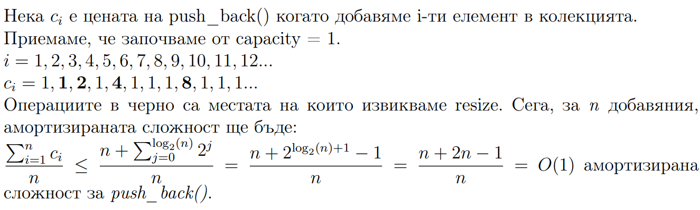

# Динамичен масив - преговор с разширение

## Какво беше динамичен масив
Динамичния масив е линейна структура от данни с произволен достъп до елементите. Различава се от статичния масив по това, че можем да имаме произволен брой елементи в колекцията. Тази структура от данни трябва да ви е добре позната, най - малкото от нейната реализация в STL наречена std::vector\<T>;
Вектора е изключително популярна структура и да я познаваме ни помага да пишем по - бързи и по - сигурни програми.

Част от интерфейса на std::vector:
* push_back(const T&) - добавя елемент в края
* pop_back() - премахва елемент от края
* operator[](size_t index) - връща елемент на индекс за четене/писане. Не прави проверка дали индекса е валиден или не
* at(size_t index) - връща елемент на индекс за четене/писане. Хвърля std::out_of_range грешка ако индексът е невалиден.

Нека разгледаме следния код:
```cpp
int main() {
    int arr[100];
    int n = 0;
    std::cin >> n;

    for(int i = 0; i < n; i++) 
        arr[i] = getValue();        // Просто някаква стойност
}
```
Тук главния проблем е какво правим когато n стане по - голямо от 100. Много просто, заделяме 200 елемента вместо 100. Лесно виждаме, как това води до множество проблеми и прави кода неефикасен когато за n не знаем достатъчно. Сега вектора ни идва на помощ:

```cpp
#include<vector>

int main() {
    std::vector<int> v;
    int n = 0;
    std::cin >> n;

    for(int i = 0; i < n; i++)
        v.push_back(getValue());
}
```
Припомняме как работи вектора: Първоначално алокираме някакъв масив. Пазим две променливи *size* и *capacity*. В *size* пишем колко елемента имаме а в *capacity* - колко е размера на алокирания масив. Момента в който *size* стане колкото *capacity* удвояваме масива. Това става чрез просто заделяне на два пъти повече памет, копиране на всичко от старата памет в новата и изтриване на новата памет.

Примерно, за начално *capacity* равно на 1 ще имаме следния сценарий:
```
           +--+
Insert 11  |11|
           +--+
           +--+--+
Insert 12  |11|12|
           +--+--+
           +--+--+--+--+
Insert 13  |11|12|13|  |
           +--+--+--+--+
           +--+--+--+--+
Insert 14  |11|12|13|14|
           +--+--+--+--+
           +--+--+--+--+--+--+--+--+
Insert 15  |11|12|13|14|15|  |  |  |
           +--+--+--+--+--+--+--+--+
```

Тази идея изглежда прекрасно. Можем да си правим колкото искаме *push_back()* и да не мислим за нищо - те хората са го измислили. Е, има още един малък проблем. Алокацията на памет не е евтина операция.
``` cpp
class DynArray {
    T* data;
    size_t size = 0;
    size_t capacity = 8;
};
```
Нека в началото *capacity* да е 8. Кога ще имаме алокация? Първо, ще алокираме памет при създаването на масива. След това, когато се опитаме да добавим девети елемент ще алокираме 16 * sizeof(T) байта. След това когато се опитаме да добавим седемнадесети елемент ще алокираме 32 * sizeof(T) байта. 
Тоест, когато въртя for цикъла във втория пример, всеки път когато *i = 2^k + 1* ще имам алокация на памет.

Това за наше щастие има как да се оправи. Когато знаем колко елемента ще пазим в динамичния масив можем да извикаме *resize(size_t)*.
Това ще направи точно една алокация. 

```cpp
#include<vector>

int main() {
    int n = 0;
    std::cin >> n;
    std::vector<int> v;

    v.resize(n);                // Ресайзва масива за да съдържа точно n елемента.

    for(int i = 0; i < n; i++) 
        v[i] = getValue();
}
```
Това е удобен трик, но не прекалявайте с него - не е нужно да ресайзваме навсякъде! Просто, ако знаете предварително колко голяма е дължината на вектора, може да направите само една алокация.
Примерно, в следния случай няма да е добра идея да правим *resize*:

```cpp
std::vector<int> filter(const std::vector<int>& arr, bool (*pred)(int)) {
    std::vector<int> result;
    // Тук не знаем предварително колко ще е размерът на result.
    for(int i = 0; i < arr.size(); i++)
        if(pred(arr[i]))
            result.push_back(arr[i]);
    return result;
}
```

## Сложността на push_back
До момента разгледахме няколко структури от данни и се стремяхме главно към O(1) сложност. Виждоме, че push_back() е доста използвана операция, каква е нейната сложност? Ами тя доста често е константна, но когато ни се наложи да направим алокация е линейна. Тоест, в най - лошия случай тя е O(n). Но това не е достатъчно добра оценка.

В случая worst case сложността е твърде песимистична. Интересува ни по - скоро колко време ще отнеме цялото изпълнение на алгоритъма използващ push_back() а не колко време ще отнеме на 17 стъпка, примерно. Приемаме по - оптимистичен подход - нека не се интересуваме от това колко е най - лошия случай на операцията а да разгледаме колко време ни отнема да направим всички операции.
Това неформално е целта на така наречения амортизиран анализ на сложност. С него няма да се занимаваме особено много, но е добре да го знаем от обща култура. 


## Сложност на вмъкване на елемент на произволен индекс
Вмъкването в края на вектора се оказа практически ефикасна операция. Но дали това остава така ако примерно искаме да вмъкнем елемент по средата? Отговорът е не - това вече си е линейна операция. В най - лошия случай ако искаме да вмъкнем елемент на първа позиция ще трябва да изместим надясно всички елементи на масива. Какво става обаче ако такъв тип вмъквания станат нужни? Има ли начин да ги направим бързи?

# Свързани списъци
Свързания списък е линейна структура от данни в която елементите не се пазят в последователна памет. Всеки елемент пази указател към следващия а ако няма следващ пазим nullptr.

```cpp
template<class T>
struct LinkedListNode {
    T data;
    LinkedListNode<T>* next;

    // Удобен конструктор!
    LinkedListNode(const T& elem, LinkedListNode<T>* n = nullptr) : data{elem}, next {n} {} 
}
```
Тук е добро място да си поговорим какво наричаме пряк и последователен достъп (или Random/direct access и Sequential access). 
* При прекия достъп можем да достъпим всеки елемент от колекцията за равно време
* При последователния достъп не можем да достъпим елемент преди да сме обходили елементите преди него в наредбата.

Свързания списък е добър пример за структура с последователен достъп. Пряк достъп имат масивите.
Има различни видове свързани списъци с които ще се занимаваме с течение на курса.
Едносвързания списък поддържа следните операции:
* push_front(const T& elem) - Добавя елемент в началото O(1)
* push_at(size_t idx, const T& elem) - Добавя елемент на индекс. O(n)
* pop_front() - Премахва елемента в началото - O(1)
* pop_at(size_t index) - Премахва елемента на позиция index O(n)

Свързания списък стандартно се представя чрез указател към първия му елемент. Доста често обаче се пази и указател към последния. Това ни помага да имаме бързо добавяне в края на списъка. Наистина, представяме списъка като два указателя - към първия и последния елемент и искаме да обединим два такива списъка това би станало за O(1) време. 

```cpp
template<class T>
class LinkedList {
private:
    struct LinkedListNode {
        T data;
        LinkedListNode<T>* next;
    };

    LinkedListNode* head;        // Началото на списъка
    LinkedListNode* tail;        // Края на списъка

public:
    void merge(const LinkedList<T>& second) {
        // O(1) сливане на два списъка без значение от размерите им
        tail->next = second.head;
        tail = second.tail;
    }
};

```
Също така, ако имаме указател към дадена позиция в списъка, можем да добавяме колкото си искаме елементи на тази позиция. Всичко става чрез пренасочване на пойнтъри.
Засега ще представяме свързания списък просто като структура с информация и указател. В следващите семинари ще разгледаме алтернативни представяния и ще видим колко точно ефикасни са спрямо дадени операции!

# Задачи

## Задача първа
Да се напише функция, която добавя елемент в началото на едносвързан списък

Пример:

LL = 2 -> 3 -> 4

insert(LL, 1)

LL = 1 -> 2 -> 3 -> 4

## Задача втора
Да се напише функция, която обръща едносвързан списък.

Пример:

LL = 1 -> 2 -> 3 -> 4 -> 5

reverse(LL);

LL = 5 -> 4 -> 3 -> 2 -> 1

## Задача трета
Да се напише функция, която открива средата на свързан списък. 
Пример:

1 -> 2 -> 3 -> 4 -> 5 => 3

1 -> 2 -> 3 -> 4      => 3

## Задача четвърта
да се напише функция която пренарежда свързания списък по следния начин:

LL = 1 -> 2 -> 3 -> 4 -> 5

reorder(LL);

LL = 1 -> 5 -> 2 -> 4 -> 3

Когато пишете задачи за свързан списък винаги пробвайте случая когато:
* Имате празен списък
* Имате списък с един елемент
* Имате списък и четни елементи
* Имате списък с нечетни елементи