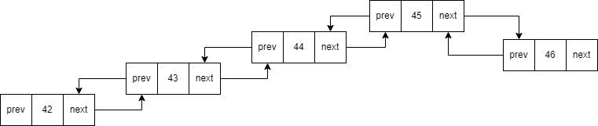

# Двойно свързани списъци. Допълнителни задачи върху списъци.

При едносвързания списък свързаните компоненти пазеха указател към следващия елемент. Ситуацията при двойно свързаните списъци е подобна - отново имаме указател към следващия елемент, но вече имаме и един допълнителен указател към предишния.



Когато представяме двусвързания списък като указател към началото и указател към края сложност на операциите му са:
* Добавяне на елемент на произволна позиция: O(n)
* Добавяне на елемент в началото/края O(1)
* Премахване на елемент от произволна позиция: O(n)
* Премахване на елемент от началото / **края**: O(1)
* Обхождане: O(n)
Тук вече премахването на елемент от края на списъка е O(1) (Защо?)

Елемента на двойно свързания списък би изглеждал по следния начин:
```cpp
template<class T>
struct DLListElement {
    T data;
    DLListElement<T>* prev;
    DLListElement<T>* next;
}
```

## Задача първа
Да се напише функция
```cpp
template<class T>
void insertSorted(std::list<T>& ll, const T& elem);
```
която приема сортиран свързан списък и добавя *elem* на правилното място.

## Задача втора
Нека имаме двусвързан списък от опашки и символи. Във всяка опашка от началото към края е записан валиден израз в обратна полска нотация. Операторите са [+, -, \*, /] а операндите за улеснение са **едноцифрени числа**.

Да се напише функция, която приема такъв списък, изчислява стойността на всички опашки, и връща дали списъка от резултатите е симетричен спрямо средата.

Пример:

```
      *           *     +   
      |           |     |   
      7           *     3    
      |           |     |   
+     +           7     *    
|     |           |     |    
5     6           7     3    
|     |           |     |    
4     1     8     1     2    
|     |     |     |     |    
* <-> * <-> * <-> * <-> * 
```
Изход: 1

Примера ще се оцени до 9 <-> 49 <-> 8 <-> 49 <-> 9, който е симетричен списък.

## Задача трета - Linked List Cycyle
Да се напише функция, която проверява дали в едносвързан списък има цикъл.

## Задача четвърта
Да се провери дали едносвързан списък е палиндром.

Пример:

Вход:
``` 1 -> 2 -> 3 -> 2 -> 1 ```

Изход: true

Вход:
``` 1 -> 2 -> 3 ```

Изход: false
