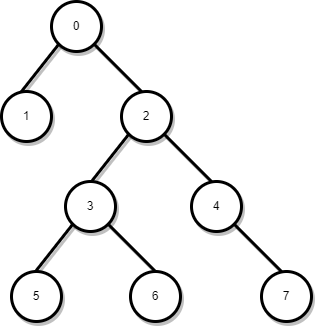
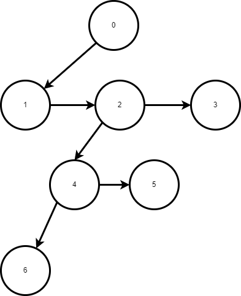

# Шести семинар по структури от данни - 14.11.2024

## Структура от данни опашка.
Абстрактната структура от данни опашка поддържа следния интерфейс:

* push(x) или enqueue(x) - Добавя елемент в опашката.
* pop() или dequeue() - Премахва елементът, който е бил в колекцията най - дълго време.
* front() - Връща елементът, който е бил в колекцията най - дълго време.
* size() - Връща броя на елементите в колекцията.

За опашката интуитивно може да се мисли като за истинска опашка (опашка пред каса, опашка от песни, ...). Тя имплементира First-In First-Out стратегия - първия добавен елемент е винаги първия изваден. Аналогично - втория добавен елемент е втория изваден и т.н. STL предлага имплементация на АСД опашка - нека разгледаме следния пример:

```cpp
#include <iostream>
#include <queue>

int main()
{
    std::queue<int> q;
    q.push(1);
    q.push(2);
    q.push(3);

    std::cout << q.top(); // 1
    q.pop();
    std::cout << q.top(); // 2
    q.pop();
    std::cout << q.top(); // 3
    q.pop();

    std::cout << q.empty(); // true
}
```

Също така класът `std::queue` поддържа и метод `back()`, който не се споменава в интерфейса на АСД.

### Къде се използват опашки
Структурата от данни опашка има множество приложения, някои от които:
* За различни алгоритми - Опашката е основна част в някои осносви алгоритми, като алгоритъмът "Търсене в широчина" (breath first search).

* Опашките се използват за реализиране на стратегии за оптимално кеширане на данни. Пример за това е стратегията LRU (least recently used), в която при препълване на кеша от него се освобождават елементите, които са били достъпвани последни във времето.

* Опашки на задачите - В много ситуации нашата програма трябва да обработи няколко задачи наведнъж. При невъзможност всички задачи да се обработят на момента, задачите се запазват в опашка и след като програмата ни приключи с изпълнение на дадена задача, тя проверява в опашката със задачи за следваща. 

* Планиране на задачи - Различни алгоритми за планиране на задачи използват опашки за да подсигурят коректната си работа.

### Начини за имплементация
Опашка можем да реализираме използвайки идеите от разгледани структури от данни.

1. Свързано представяне - Можем да преизползваме идеята на свързания списък и да ограничим интерфейса. Операциите `push` и `pop` могат да се реализират в константно време използвайки двусвързано представяне.

2. Представяне чрез динамичен масив - Можем да преизползваме идеята за динамичен масив и да ограничим интерфейса. Всъщност, реализацията ще е "окастрена" версия на разгледаната структура от данни `deque`. Това не трябва да ни очудва - името `deque` произлиза от `double ended queue`.

3. Представяне чрез статичен масив - Понякога имаме нужда от ограничени опашки. В такъв случай можем да използваме статичен масив - при препълване на опашката можем или да премахваме най - рано добавения елемент или да хвърляме грешка.

Реализацията в stl използва контейнер, който поддържа операции `push_back(x)`, `pop_front()`, `back()` и `front()`. Имайки тези четири операции можем да реализираме опашка без да се интересуваме как е реализиран контейнера. Това също така е пример за `Adapter Design Pattern` - преобразуваме интерфейса на един клас към друг.

По подрзбиране контейнера, който се използва, е std::deque. Можем да променим това:

```cpp
#include <queue>
#include <vector>

int main()
{
    std::queue<int, std::vector<int>> q;
}
```

## Структура от данни стек.
Абстрактната структура от данни стек поддържа следните операции:

* push(x) - Добавя елемент към колекцията.
* pop() - Премахва последния добавен елемент.
* top() - Връща последния добавен елемент.
* size() - Връща броя на елементите на стека.

Стекът имплементира Last-In First-Out стратегия. За стека можем да си мислим като купчина чинии наредени една върху друга. Можем да премахнем единствено най - горната чиния (без да счупим нещо).

В STL има готова имплементация на стек - `std::stack`. Нека разгледаме следния пример:
```cpp
#include <stack>
#include <iostream>

int main()
{
    std::stack<int> s;

    s.push(1);
    s.push(2);
    s.push(3);

    std::cout << s.top(); s.pop(); // 3
    std::cout << s.top(); s.pop(); // 2
    std::cout << s.top(); s.pop(); // 1
}
```
### Къде се използват стекове
* В различни алгоритми - Използва се в backtracking алгоритми (търсене на път в лабиринт, обхождане в дълбочина, ...) както и в алгоритми за обработка на текст.
* Системния стек - Голяма част от езиците за програмиране са ориентирани около тази идея.
* Undo/redo операции.

### Начини за имплементация
Начините за имплементация съвпадат с тези на опашката:
* Свързано представяне - тук разликата е, че можем да имплементираме стек поддържащ константни операции по добавяне и премахване използвайки само едносвързано представяне.
* Статичен масив (ограничен стек)
* Динамичен масив - ограничен интерфейс на deque или vector.

Имплементацияна в stl също намопня имплементацията на `std::queue`. Отново, ако желаем, можем да подадем контейнер който да е отговорен за работата на стека.

## Задача за разпознаване на балансиран низ от скоби.
Да се имплементира функция
```cpp
bool balanced_brackets(const std::string& str);
```

която връща истина ако скобите, съдържащи се в в подадения низ са балансирани, и лъжа в противен случай.

## Имплементация на ForwardIterator за двоично наредено дърво.

## Дървета
Свързан граф, който не съдържа цикли наричаме дърво.

## Примери за дървета
Вероятно всеки вече в един или друг момент се е сблъсквал с дървета. Това е дърво:



Това също е дърво:


## Малко дефиниции
| Понятие                        | Дефиниция 
| :---                           |    :----:   
| Дърво                          | Свързан ацикличен граф.
| Кореново дърво                 | Дърво, в което точно един връх е избран за корен. В курса говорейки за дърво дърво разбираме кореново дърво.
| Листо                          | Връх без наследници.
| Вътрешен връх                  | Връх, който не е листо или корен.
| Разклоненост                   | Максималния брой деца на кой да е връх.
| Височина на връх *u*           | Максималното разстояние между *u* и кое да е листо.
| Дълбочина на връх *u*          | Разстоянието между корена и *u*.
| Височина на дърво              | Височината на корена.
| Ниво *k*                       | Множеството от всички върхове с дълбочина *к*.
| Предшественик на връх *u*      | За връх *v* казваме, че е предшественик на *u* ако *v* се съдържа в пътя между корена и *u*.
| Наследник на връх *u*          | За връх *v* казваме, че е наследник на *u* ако *u* е предшественик на *v*.

В дефиницията на предшественик, казваме "пътя между корена и *u*". Важно свойство на дърветата е, че между всеки два върха има **точно един път**. Това свойство е необходимо и достатъчно условие граф да е дърво, ако в един граф имаме точно един път между всеки два върха то той е дърво. Какво би се объркало ако съществуват два върха без път между тях? Какво би станало ако имаме два пътя между два върха?

## Височина на дърво
Височината на дървото ще е от особен интерес за нас. Колко е максималната височина на дърво с *n* върха? Най - много тя може да стане *n*. Това се случва когато дървото е изродено. 
Пример за изродено дърво с 4 върха:


Има ли долна граница за височината на дърво? Ако нищо не знаем за дървото, то височината му най - малко може да е 1. Това се случва когато всички възли, различни от корена, са негови наследници (т.е. когато нямаме вътрешни върхове).
Доста често обаче, когато работим с дървета, знаем тяхната разклоненост. 
Нека имаме дърво с *n* върха и разклоненост *k*. Тогава то не може да стане по - ниско от $\lfloor \log_k n \rfloor$.

Опитайте се да начертаете дърво с разклоненост 2 и 8 върха. Възможно ли е височината му да е по - малка от 3?

## Поддървета
Неформално, поддърво вкоренено във връх *u* е върхът *u* и всичко под него (всички негови наследници).


## Двоични дървета.
Двоичното дърво е дърво с (максимална) разклоненост 2. Това означава, че всеки връх има най - много две деца. В общия случай различаваме децата като ляво и дясно дете (или ляв и десен наследник). 
За двоичните дървета можем също да си мислим като рекурсивно дефинирана структура от данни:
* Празното дърво е двоично дърво.
* Дърво с един връх и без ребра е двоично дърво.
* Възел с ляв наследник двоично дърво и десен наследник двоично дърво е двоично дърво.

Голяма част от алгоритмите върху двоичните дървета са рекурсивни точно поради този удобен начин да дефинираме двоично дърво.

Дървото в пример 1 е двоично дърво. Дървото в пример 2 не е двоично дърво, понеже има възел от степен 4.

## Двоични наредени дървета
Двоичното наредено дърво е двоично дърво за което е вярно следното **свойство:**

- Нека *u* е възел в двоично наредено дърво. Стойността на всеки връх от лявото поддърво на *u* е по - малка от стойността на *u*. Стойността на всеки връх от дясното поддърво на *u* е по - голяма от стойността на *u*.

Нищо не ни пречи и да поддържаме повтарящи се елементи - тогава в лявото (или в дясното) поддърво ще държим по - малки или равни (или по - големи или равни) елементи.

Едно важно нещо, без което не можем да имаме двоично наредено дърво, е свойството на **стойностите на възлите да са сравними**. Не можем да строим двоично наредено дърво от несравними стойности. 

## Представяне на дървета

### Свързано представяне - Двоични дървета
Представяме двоично дърво като:

```cpp
template<class T>
struct Tree 
{
    T data;
    Tree<T>* left;
    Tree<T>* right;

    Tree(const T& data_, Tree<T>* l = nullptr, Tree<T>* r = nullptr) :
        data (data_),
        left (l),
        right (r) {}
};
```

От тук представяме дървото като указател към обект от тип Tree.

Дървото от пример 1, представено по този начин, би изглеждало така:

```cpp
Tree<int>* create_exaple_one() {
    return new Tree<int>(
        0,                              // Корена
        new Tree<int>(1),               // Лявото поддърво
        new Tree<int>(                  // Дясното поддърво
            2,
            new Tree<int>(3, new Tree<int>(5), new Tree<int>(6)),
            new Tree<int>(4, nullptr, new Tree<int>(7))
        )
    );
}
```

Как можем да проверим дали възел е листо?
```cpp
template<class T>
bool is_leaf(const Tree<T>* t) {
    return t != nullptr && t->left == nullptr && t->right == nullptr;
}
```

### Списък на бащите
Чрез свързаното представяне в някакъв смисъл слизаме от корена към листата. Какво правим обаче ако искаме да се качваме от листата към корена?

Нека имаме дърво с *n* върха. Върховете можем да номерираме с числа от 0 до *n-1*. Едно валидно номериране можем да видим в пример едно. Коренът е 0, левия наследник 1, десния 2 и така, по нива, от ляво надясно им даваме индекси от 0 до *n* - 1.

Разглеждаме масив parent с *n* елемента за който е вярно: **В parent[i] е записан номера на бащата на връх с номер i. Ако върхът с номер i е корен (а корена няма баща) просто пишем -1**.
Дървото от пример 1 може да се представи чрез списък на бащите по следния начин:

* [-1, 0, 0, 2, 2, 3, 3, 4]

Едно от предимствата на това представяне е, че можем да представим дърво с произволна разклоненост. Все пак няма значение разклонеността, ако можем да номерираме възлите с числа от 0 до *n-1* можем да го представим по този начин.

Недостатъците на това представяне са, че добавянето, проверката дали връх е листо, премахването и други операции върху дървета стават сложни.

### Ляв син десен брат
Представянето чрез масив на бащите ни позволи да представим дърво с произволна разклоненост. Има поне още два начина да се представи такова дърво. За всеки възел пазим указател към най - левия му син и най - десния му брат:

```cpp
template<class T>
struct Tree{ 
    T data;
    Tree<T>* leftChild;
    Tree<T>* rightSibling;
};
```

Така от корена можем да достъпим кой да е връх на произволно разклоненото дърво. 


Тук в leftChild указателя на 2 ще е записан адреса на 4. В rightSibling указателя на 2 ще е записан 3. Ако някой възел няма ляво дете или десен брат, то указателя просто е nullptr.
Предимството е, че за същата памет, с която представихме двоично дърво, можем да представим дърво с произволна разклоненост. Недостатъка е, че имаме последователен достъп до децата. Тоест ако искам да взема третото дете на връх *u* първо ще трябва да сляза до най - лявото му дете и да се предвижа две позиции надясно. Ако често имаме нужда да четем дете на позиция k това може би не би било най - подходящото представяне.

### Чрез вектор от децата
Разглеждаме следното представяне:
```cpp
template<class T>
struct Tree { 
    T data;
    std::vector<Tree<T>*> children;
};
```
Ако искаме да вземем третото дете на връх *u* просто правим u->children[2]. Предимството е очевидно - нямаме последователен достъп до децата. Недостатъкът е, че възлите започват да заемат повече памет. Размера на вектора (в x64) е 32 байта. Ако възлите ни са от тип int то размера на структурата би бил 40 байта.
Вектора ще направи алокации, което също в някакъв смисъл забавя програмата. Но пък веднъж като построим дървото имаме бърз достъп до децата.

### Чрез допълнителен parent указател
Представянето чрез масив на бащите беше хубаво, но проблемът е, че трудно добавяме и изваждаме елемент от колекцията. Ако искаме да имаме дърво което поддържа добавяне и изтриване и също така може да намира родителя си, то просто добавяме още един указател. 
```cpp
template<class T>
struct Tree {
    T data;
    Tree* parent;
    Tree* left;
    Tree* right;

    Tree(T data, Tree<T>* p = nullptr, Tree<T>* l = nullptr, Tree<T>* r = nullptr) : data {data}, parent {p}, left {l}, right {r} {}
}
```
Тук проблемът е, че отново плащаме цената от 4 (или 8) байта за допълнителен указател. Но пък ако ни трябва добавяне, премахване и движение както от корен към листа така и листа корен плащаме малко памет и имаме всичко това!

## Задача първа
Да се напише функция, който принтира всички листа на дърво.

## Задача втора
Да се напише функция, която принтира всички пътища от корена до което и да е листо.

## Задача трета
Да се напише функция *max((Tree\<T>\* tree)* която връща най - големия елемент в двоично дърво. Да се реализира същата функция за двоично наредено дърво. Да се реализира функция намираща най - малкия елемент.

## Задача четвърта
Да се реализира функция, която връща височината на двоично дърво.

## Задача пета
Да се напише функция, която обхожда елементите на двоично дърво по схемата ляво-корен-дясно. (още позната като inorder traversal). Извикайте функцията върху двоично наредено дърво. Какво забелязвате?
