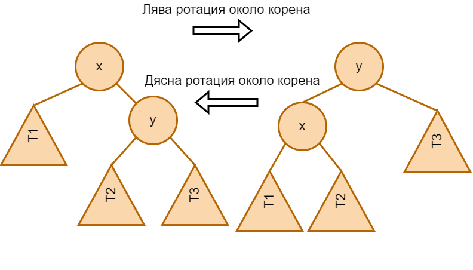

# Седми семинар по структури от данни - 21.11.2024

## Балансирани дървета
Последния семинар дефинирахме височина на дърво и се разбрахме, че това ще бъде важно понятие за нас. Намекнахме, че е желателно да държим дърветата си ниски. Едно свойство на дърветата, което ги държи сравнително ниски е **балансираността.**

Двоично дърво наричаме **балансирано** ако за всеки негов възел височините на лявото поддърво и на дясното поддърво се различават **най - много с единица**.

Също така дърво ще наричаме **идеално балансирано** ако за всеки негов възел броя на възлите в лявото поддърво и броя на възлите в дясното поддърво се различават най - много с единица.

В балансираните и идеално балансираните дървета сложността на операциите добавяне, търсене, изтриване стават $\mathcal{O} (\log_2 n)$.

## Ротации и запазване на балансираността
Ротацията е операция върху наредени двоични дървета, която запазва свойството им да са наредени (след произволен брой ротации върху наредено двоично дърво то остава наредено).



Ротациите обаче променят височината на лявото и дясното поддърво на корена. След лява ротация височината на лявото поддърво нараства с поне единица а височината на лявото поддърво намалява с поне единица (защо?).

Разбрахме се, че ще се стараем да си държим дърветата ниски. Тези операции ще ни бъдат полезни в тази ни задача.

## Балансирани дървета
Двоично дърво, което поддържа log(n) височина при динамични операции се нарича **балансирано дърво**.

Има много стратегии за балансиране на дървета което влече и съществуването на различни видове балансирани дървета.

```
Баланс фактор на възел k определяме като: bf(k) = h(k->right) - h(k->left). 
```

```
Целта ни е за всеки възел k bf(k) да е в множеството {-1, 0, 1}.
```

Трябва да поддържаме това свойство при всяко добавяне или премахване на възел. Тук на помощ идват ротациите.

## Как разбираме, че сме нарушили балансираността на възел?

## insert

## erase