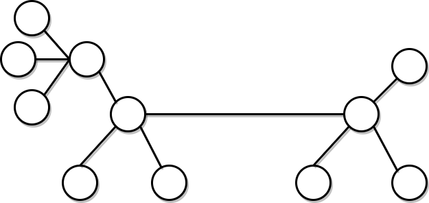
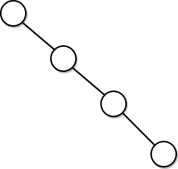
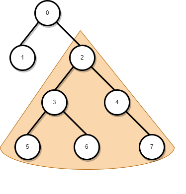

# Дървета - част 1
Свързан граф, който не съдържа цикли наричаме дърво. Дървета се използват от далечната 1875 година когато английски математик на име Arthur Cayley ги използва за да брои видове химични съединения.

## Примери за дървета
Вероятно всеки вече в един или друг момент се е сблъсквал с дървета. Това е дърво:


Това също е дърво:



Дърветата са практически използваеми в компютърните науки, много алгоритми и системи ги използват за множество различни цели.

## Малко дефиниции
| Понятие                        | Дефиниция 
| :---                           |    :----:   
| Дърво                          | Свързан ацикличен граф.
| Кореново дърво                 | Дърво, в което точно един връх е избран за корен. Най - често в курса когато пишем дърво разбираме кореново дърво.
| Листо                          | Връх без наследници.
| Вътрешен връх                  | Връх, който не е листо или корен.
| Разклоненост                   | Максималния брой деца на кой да е връх.
| Височина на връх *u*           | Максималното разстояние между *u* и кое да е листо.
| Дълбочина на връх *u*          | Разстоянието между корена и *u*.
| Височина на дърво              | Височината на корена.
| Ниво *k*                       | Множеството от всички върхове с дълбочина *к*.
| Предшественик на връх *u*      | За връх *v* казваме, че е предшественик на *u* ако *v* се съдържа в пътя между корена и *u*.
| Наследник на връх *u*          | За връх *v* казваме, че е наследник на *u* ако *u* е предшественик на *v*.

В дефиницията ва предшественик, казваме "пътя между корена и *u*". Важно свойство на дърветата е, че между всеки два върха има **точно един път**. Това свойство е необходимо и достатъчно условие граф да е дърво, ако в един граф имаме точно един път между всеки два върха то той е дърво. Какво би се объркало ако съществуват два върха без път между тях? Какво би станало ако имаме два пътя между два върха?

## Височина на дърво
С височини на дървета ще се занимаваме много. Неформално, доста често е полезно да държим дървото ниско, това в някакъв смисъл минимизира възможните "слизания надолу".

Колко е максималната височина на дърво с *n* върха? Най - много тя може да стане *n*. Това се случва когато дървото е изродено. 
Пример за изродено дърво с 4 върха:



Има ли долна граница за височината на дърво? Ако нищо не знаем за дървото, то височината му най - малко може да е 1. Това се случва когато всички възли, различни от корена, са негови наследници (т.е. когато нямаме вътрешни върхове).
Доста често обаче, когато работим с дървета, знаем тяхната разклоненост. 
Нека имаме дърво с *n* върха и разклоненост *k*. Тогава то не може да стане по - ниско от floor(log<sub>k</sub>(n)).

Опитайте се да начертаете дърво с разклоненост 2 и 8 върха. Възможно ли е височината му да е по - малка от 3?

## Поддървета
Неформално, поддърво вкоренено във връх *u* е върхът *u* и всичко под него. Формалната дефиниция ще оставим за друг курс, но това е пример за поддърво, вкоренено във връх 2:



## Двоични дървета.
Двоичното дърво е дърво с максимална разклоненост 2. Това означава, че всеки възел има най - много две деца. В общия случай различаваме децата като ляво и дясно дете (или ляв и десен наследник). 
За двоичните дървета можем също да си мислим като рекурсивно дефинирана структура от данни:
* Празното дърво е двоично дърво
* Дърво с един връх и без ребра е двоично дърво
* Възел с ляв наследник двоично дърво и десен наследник двоично дърво е двоично дърво.

Голяма част от алгоритмите върху двоичните дървета са рекурсивни точно поради този удобен начин да дефинираме двоично дърво.

Дървото в пример 1 е двоично дърво. Дървото в пример 2 не е двоично дърво, понеже има възел от степен 4.

Двоичните дървета поддържат операции по добавяне на елемент и премахване на елемент. Проблемът е, че нищо не знаем за елементите. Нищо не знаем за височината. Единственото което знаем е, че това е дърво с разклоненост 2.

## Двоични наредени дървета
Двоичното наредено дърво е двоично дърво за което е вярно следното **свойство:**

- Нека *u* е възел в двоично наредено дърво. Стойността на всеки възел от лявото поддърво на *u* е по - малка от стойността на *u*. Стойността на всеки възел от дясното поддърво на *u* е по - голяма от стойността на *u*.

Можем да имаме повтарящи се елементи, това не е проблем. Можем да ги слагаме само отляво или само отдясно, важното е да се поддържа една конвенция.

Едно важно нещо, без което не можем да имаме двоично наредено дърво, е свойството на стойностите на възлите да са сравними. не можем да строим двоично наредено дърво от несравними стойности. Двоичните наредени дървета са сравнително лесни за разбиране и ползване и притежават интересни свойства, с който ще се занимаваме тепърва!

## Представяне на дървета

### Свързано представяне - Двоични дървета
Свързаното представяне е ужасно удобно когато поддържаме операции като добавяне или изтриване. То ще се ползва най - често в курса, представяме двоично дърво като:

```cpp
template<class T>
struct Tree {
    T data;
    Tree* left;
    Tree* right;

    Tree(T data, Tree<T>* l = nullptr, Tree<T>* r = nullptr) : data {data}, left {l}, right {r} {}
}
```

От тук всеки указател от типа *Tree\<T>** е валидно дърво. Ако то е празно стойността му би била nullptr. Ако е непразно, данните записани във възела му достъпваме чрез data полето, а лявото и дясното поддърво достъпваме съответно чрез left и right.

Дървото от пример 1, представено по този начин, би изглеждало така:

```cpp
Tree<int>* createExampleOne() {
    return new Tree<int>(
        0,                              // Корена
        new Tree<int>(1),               // Лявото поддърво
        new Tree<int>(                  // Дясното поддърво
            2,
            new Tree<int>(3, new Tree<int>(5), new Tree<int>(6)),
            new Tree<int>(4, nullptr, new Tree<int>(7))
        )
    );
}
```

Или пък примерно, как можем да проверим дали възел е листо? Спомняме си дефиницията на листо и пишем:
```cpp
template<class T>
bool isLeaf(const Tree<T>* t) {
    return t != nullptr && t->left == nullptr && t->right == nullptr;
}
```

### Списък на бащите
Очевидно, чрез свързаното представяне в някакъв смисъл слизаме от корена към листата. Какво правим обаче ако искаме да се качваме от листата към корена?

Нека имаме дърво с *n* върха. Върховете са номерирани с числа от 0 до *n-1*. Едно валидно номериране можем да видим в пример едно. Корена е 0 левия наследник 1, десния 2 и така, по нива, от ляво надясно им даваме индекси от 0 до *n* - 1. Разбира се, това номериране не е единствено, но някак е най - удобно.

Разглеждаме масив tArray с *n* елемента за който е вярно: **В tArray[i] е записан номера на бащата на връх с номер i. Ако върхът с номер i е корен (а корена няма баща) просто пишем -1**.
Дървото от пример 1 може да се представи чрез списък на бащите по следния начин:

* [-1, 0, 0, 2, 2, 3, 3, 3]

Едно от предимствата на това представяне е, че можем да представим дърво с произволна разклоненост. Все пак няма значение разклонеността, ако можем да номерираме възлите с числа от 0 до *n-1* можем да го представим по този начин.

Но с какво ни помага това? Тук движението става от листата към корена. Вярно е, че за всеки връх, за константно време знаейки номера му, мога да намеря баща му. Е баща му също е възел, тоест мога да намеря и неговия баща. 

Така движението в някакъв смисъл не става (корен -> листа) а става (връх -> корен). Това представяне се използва в задачи за намиране на предшественици (и не само).

Недостатъците на това представяне са, че добавянето, проверката дали възел е листо, премахването и други операции върху дървета стават сложни.

Представянето на дървета с масиви е използвано в някои алгоритми и може много скоро нещо подобно да се появи.

### Ляв син десен брат
Представянето чрез масив на бащите ни позволи да представим дърво с произволна разклоненост. Има поне още два начина да се представи такова дърво. За всеки възел пазим указател към най - левия му син и най - десния му брат:

```cpp
template<class T>
struct Tree{ 
    T data;
    Tree<T>* leftChild;
    Tree<T>* rightSibling;
};
```

Така от корена можем да достъпим кой да е връх на произволно разклоненото дърво. 


Тук в leftChild указателя на 2 ще е записан адреса на 4. В rightSibling указателя на 2 ще е записан 3. Ако някой възел няма ляво дете или десен брат, то указателя просто е nullptr.
Предимството е, че за същата памет, с която представихме двоично дърво, можем да представим дърво с произволна разклоненост. Недостатъка е, че имаме последователен достъп до децата. Тоест ако искам да взема третото дете на връх *u* първо ще трябва да сляза до най - лявото му дете и да се предвижа две позиции надясно. Ако често имаме нужда да четем дете на позиция k това може би не би било най - подходящото представяне.

### Чрез вектор от децата
Тук идеята е супер интуитивна:
```cpp
template<class T>
struct Tree { 
    T data;
    std::vector<Tree<T>*> children;
};
```
Ако искаме да вземем третото дете на връх *u* просто правим u->children[2]. Предимството е очевидно - нямаме последователен достъп до децата. Недостатъкът е, че възлите започват да заемат повече памет. Размера на вектора (в x64) е 32 байта. Ако възлите ни са от тип int то размера на структурата би бил 40 байта.
Вектора ще направи алокации, което също в някакъв смисъл забавя програмата. Но пък веднъж като построим дървото имаме бърз достъп до децата.

### Чрез допълнителен parent указател
Представянето чрез масив на бащите беше хубаво, но проблемът е, че трудно добавяме и изваждаме елемент от колекцията. Ако искаме да имаме дърво което поддържа добавяне и изтриване и също така може да намира родителя си, то просто добавяме още един указател. 
```cpp
template<class T>
struct Tree {
    T data;
    Tree* parent;
    Tree* left;
    Tree* right;

    Tree(T data, Tree<T>* p = nullptr, Tree<T>* l = nullptr, Tree<T>* r = nullptr) : data {data}, parent {p}, left {l}, right {r} {}
}
```
Тук проблемът е, че отново плащаме цената от 4 (или 8) байта за допълнителен указател. Но пък ако ни трябва добавяне, премахване и движение както от корен към листа така и листа корен плащаме малко памет и имаме всичко това!

## Задача първа
Да се реализира функция, която добавя елемент в двоично наредено дърво.

## Задача втора
Да се напише функция *contains(Tree\<T>* tree, const T& elem)* която връща дали елемента се съдържа в двоично дърво. Да се реализира същата функция за двоично наредено дърво.

## Задача трета
Да се напише функция *max((Tree\<T>* tree)* която връща най - големия елемент в двоично дърво. Да се реализира същата функция за двоично наредено дърво. Да се реализира функция намираща най - малкия елемент.

## Задача четвърта
Да се реализира функция, която връща височината на двоично дърво.

## Задача пета
Да се напише функция, която обхожда елементите на двоично дърво по схемата ляво-корен-дясно. (още позната като inorder traversal). Извикайте функцията върху двоично наредено дърво. Какво забелязвате?
