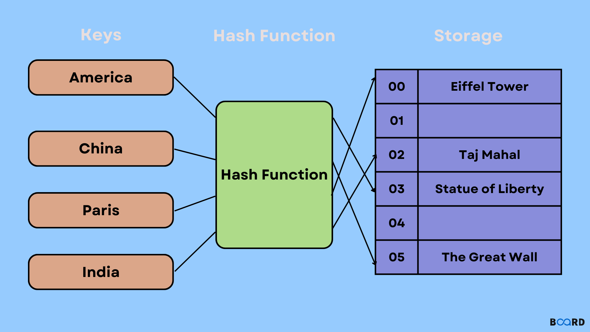
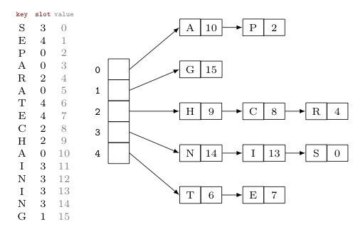
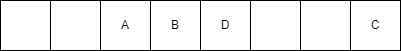

# Девети семинар по структури от данни - 04.12.2024

## Имплементация на приоритетна опашка

## Heap sort

# Абстрактен тип данни dictionary. Хеш таблици. Реализация на феш таблици.
*A common problem in computer science is the representation of a mapping between two sets.*

## Абстрактен тип данни множество (set) и речник (dictionary/map/associative array)

За абстрактен тип данни множество поддържаме:
* insert(key)
* contains(key)
* erase(key)

В абстрактния тип данни "речник" всеки елемент е обвързан с ключ.
* insert(key, value)
* contains(key) / find(key)
* erase(key)

Една възможна имплементация на речник би била двоично наредено (балансирано) дърво. Наредбата ще се поражда от ключовете (искаме те да са сравними). Във възлите на дървото ще пазим ключ и стойност - намирайки ключа в логаритмично време имаме и стойността му.

Тази имплементация влече логаритмично време по големината на колекцията за всички операции. Хеш таблиците са структура от данни, която подобрява това време, и премахва нуждата да имаме сравними ключове.

## Хеш функции
Нека U е съвкупност от всички възможни ключове с които работим. Ако ключовете ни са числа U ще бъде множеството от възможните стойности на числата. Възможно е да имаме и ключове, които не са числа (примерно низове). 

Хеш функция наричаме функция от типа: h: U -> {0, ..., n}. Ако си представим, че пазим ключовете в масив с големина `n`, то хеш функцията ще даде индекс на всеки ключ.

Съществуват много феш функции. Примерно:
```cpp
int hashDummy(int key) {
    return 0;
}
```
е валидна, но неизползваема хеш функция. 

Какво наричаме добра (или използваема) хеш функция?
* Функцията трябва да използва всички данни от ключа.
* Функцията трябва равномерно да разпределя елементите.
* Функцията трябва да е бърза за изчисляване.
* Желателно е за подобни ключове функцията да връща различни резултати.

Добрата хеш функция се "държи добре" върху определен вход, но няма универсална хеш функция. 

Също така, никой не ни гарантира, че броят на възможните ключове е по - малък от `n` (т.е. е съвсем възможно |U| > n). Това означава, че е възможно да съществуват два елемента за които `x != y && h(x) == h(y)`. По - просто казано - възможно е да има два елемента, които имат еднакъв индекс.

Това наричаме **колизия**.

## Използване на хеш функции в хеш таблиците.
Структурата от данни хеш таблица трябва да поддържа вмъкване, търсене и премахване по подаден ключ (и стойност във вмъкването). Ако разполагаме с добра хеш функция за съвкупността от ключове, с които нашата таблица работи, можем да приложим следната стратегия:

Създаване: 
1. Създай масив с големина n който пази стойности.

Вмъкване:
1. Намери индекса на ключа използвайки хеш функцията
2. Добави стойността на намерения индекс.

Търсене:
1. Намери стойността на ключа използвайки хеш функцията
2. Промери дали има елемент на този индекс.

Премахване:
1. Намери стойността на ключа използвайки хеш функцията
2. Ако има елемент на този индекс то премахни.

Тази стратегия е **твърде оптимистична!** Ако хеш функцията ни няма колизии всичко ще е наред. Ако има колизии тази стратегия е обречена на провал - какво правим когато искаме да вмъкнем елемент, чийто ключ има същия хеш индекс като вече съществяващ такъв?

В следващите няколко секции ще се занимаем с две неща:
1. Техники за справяне с колизии.
2. Техники за оптимална реализация на хеш таблица.



## Справяне с колизии - Separate chaining
При представената неуспешна стратегия, създавайки хеш таблицата, заделяхме масив с n елемента, който пази стойности. Нека елементите на този масив не са стойности **а контейнери, които пазят такива.** Такива контейнери наричаме buckets или кофи.

Сега, ако имаме колизия, просто добавяме елемента най - отзад на свързания списък. При търсенето също има промени - вече обхождаме свързания списък за да намерим дали наистина ключа съществува, или просто кофата е напълнена с ключове, съдържащи други стойности.

Аналогично е при премахването - отново трябва да обходим свързания списък.



За момента не сме казали нищо за сложността на която и да е операция. Тази имплементация ни води до O(n) worst case complexity. Това би се случило, примерно, ако добавим n елемента с ключове, образуващи колизия. И се опитаме да добавим, премахнем или потърсим ключ, също образуващ колизия. 

Такова поведение **е слабо вероятно** използвайки добра хеш функция, но ако използваме функция от типа на `hashDummy` е очаквано.

## Използване на други структури за да подобрим O(n) worst case
Лошата горна граница за търсенето ни идва от факта, че използваме свързани списъци. Вече имаме дървета, които ни позволяват O(log(n)) търсене, защо вместо свързани списъци не използваме тях примерно?

Това е интересна тема за разсъждение - от една страна лошото търсене не се дължи толкова на свързания списък колкото на факта, че елементите не са разпределени добре. 

Дървото ще забърза нещата, но така не поддържаме ли просто едно бавно дърво (или няколко такива)?

Такива техники все пак се използват. [Тук](https://openjdk.org/jeps/180) можем да прочетем:

```
The principal idea is that once the number of items in a hash bucket grows beyond a certain threshold, that bucket will switch from using a linked list of entries to a balanced tree. In the case of high hash collisions, this will improve worst-case performance from O(n) to O(log n).
```


## Недостатъци на Separate chaining 
Освен O(n) сложността в най - лошия случай това решение добавя ниво на забавяне към търсенето, понеже свързаните списъци нямат cache locality. Следващата стратегия се стреми да подобри този проблем.

## Open adressing
В предишната стратегия елементите се държаха извън хеш таблицата (в свързани списъци). В отвореното адресиране **всички** елементи се държат в хеш таблицата.

Все пак това ни връща на първоначалната стратегия. Този път няма да променяме паметта, в която държим елементите, а ще променяме начините по които ги търсим, добавяме или изтриваме.

Един работещ начин за подобна промяна е следния:

## Linear probing

### Добавяне
Разглеждаме елементите и техните хеш кодове: {A, 2}, {B, 3}, {C, 7}, {D, 2}.

Добавянето на първите три в някакъв смисъл е лесно. Имаме следния сценарий:


Какво правим обаче когато имаме колизия (както е в случая с D). Ами започваме линейно да търсим първата свободна клетка. Там добавяме D.



## Търсене
Сега, да предположим, че търсим D. Генерираме неговия хеш код, но на негово място стои А. Логично е, познавайки стратегията си, да не се отказваме и да продължим да търсим. Търсим до момента в който не срещнем първата празна клетка.

## Изтриване
Тук нещата стават малко по - сложни. Да кажем, че изтрием B. След това търсим D. Но сега между A и D **има празна клетка**. Това погрешно ще ни каже, че елементът не е в колекцията.

**Решение:** добавяме два флага на клетката: empty и deleted. Ако клетката е била изтрита **не спираме да търсим**. Спираме при първата **празна клетка**. 

**Няма проблем да добавяме елементи в изтрита клетка.**

##  Недостатъци на linear probing стратегията
Този метод работи, но какво правим когато всички клетки се запълнят? При n + 1 - вото добавяне тази стратегия спира да работи. Момента в който запълним всички клетки можем да преоразмерим масива (resize).

## Преоразмеряване на хеш таблици
При стратегията Separate chaining нямахме проблема с преоразмеряването. Обикновено обаче такова присъства. В случай на 10 кофи и 10000 елемента операциите започват да стават по - бавни.

```
LoadFactor = #elements / #buckets
```

Обикновено хеш таблиците имат два начални параметъра - първоначална големина на масива (initial capacity) и load factor. Втория ни помага да разберем кога да направим resize. Обикновено се използват стойности като 0.7 или 0.75.

## Някои хеш функции
* Метод на деленето (division method): h(k) = k mod n.
* Метод на умножението (multiplication method): h(k) = floor( n * (kA mod 1) )
Където А е някакво число между 0 и 1. mod 1 изважда единствено дробната част от умножението.

* Готови хеширащи функции:
Добрите хеширащи функции често са сложни. Съществуват готови хеширащи функции, които можем да използваме като черни кутии (MD5, SHA, ...)