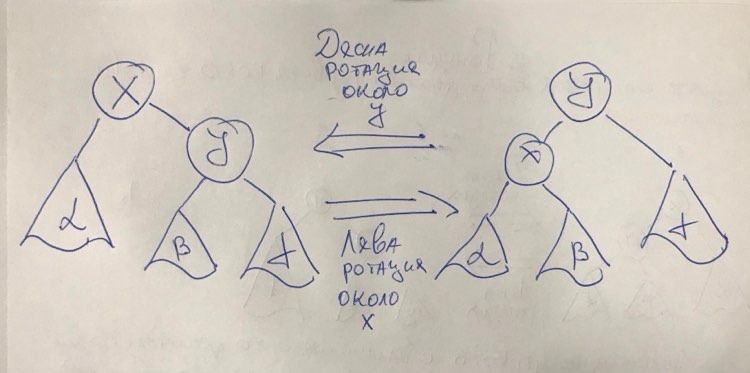

# Дървета - част 2. Балансирани дървета, ротации и задачи върху дървета.

## Минимум и максимум в дърво
Последния семинар разглеждахме задачата за намиране на минимален или максимален елемент в дърво. Тази задача е сравнително лесна, но нека разгледаме следния случай:

```cpp
template<class T>
T maxElem(const Tree<T>* t) {
    T result = t->data;

    if(t->left != nullptr) 
        result = std::max(result, maxElem(t->left));
    
    if(t->right != nullptr) 
        result = std::max(result, maxElem(t->right));
        
    return result;
}
```
Това решение работи почти винаги. Какво става ако t e nullptr? 

Ако знаехме, че дървото е от тип int, лесно можехме да връщаме INT_MAX, но в случая не знаем какъв тип е скрит зад Т.
Един от начините да се справим с този проблем е да връщаме T* вместо Т. Така, ако дървото е nullptr ние също ще връщаме nullptr. Това е валиден начин, и може би стандартния начин по който бихме подходили в С или във версиите на С++ преди С++17.

## std::optional\<T>
std::optional\<T> е клас който в някакъв смисъл "обвива" елемент от тип Т. Както името подсказва той или има стойност.. или няма.
Този тип се поддържа от с++17, та ако искате да го използвате бъдете сигурни, че компилирате с правилната версия на с++.

Примерно, кодът използвайки std::optional би изглеждал по следния начин:

```cpp
#include<optional>
#include"tree-utils.h"

template<class T>
std::optional<T> max(const Tree<T>* t) {
	if (t == nullptr)
		return {};                          // Това означава, че std::optional<T> няма стойност
	
	std::optional<T> left  = max(t->left); // Вземи макса на левия
	std::optional<T> right = max(t->left); // Вземи макса на десния

	T res = t->data;
    // Ако левия има value тоест дървото не е празно...
	if (left.has_value() && left.value() > res)
		res = left.value();

    // Аналогично за десния
	if (right.has_value() && right.value() > res)
		res = right.value();

	return res;
}

int main() {
    Tree<int>* t = nullptr;
    std::optional<int> result = max(t);

    if(result.has_value()) 
        std::cout << "Max element is: " << result.value() << std::endl;
    else
        std::cout << "Empty tree!!"; 
}
```
Логиката зад std::optional далеч не идва от с++. Езици като Haskell, Rust и други поддържат подобни структури.

## Балансирани дървета
Последния семинар дефинирахме височина на дърво и се разбрахме, че това ще бъде важно понятие за нас. Намекнахме, че е желателно да държим дърветата си ниски. Едно свойство на дърветата, което ги държи сравнително ниски е **балансираността.**

Двоично дърво наричаме **балансирано** ако за всеки негов възел височините на лявото поддърво и на дясното поддърво се различават **най - много с единица**.

Също така дърво ще наричаме **идеално балансирано** ако за всеки негов възел броя на възлите в лявото поддърво и броя на възлите в дясното поддърво се различават най - много с единица.

В балансираните и идеално балансираните дървета сложността на операциите добавяне, търсене, изтриване стават O(log<sub>2</sub>(n)).

С балансирани дървета ще се занимаваме много подробно следващия път. Засега само дефинираме неща, които ще ни бъдат от голяма полза при реализацията на едно такова дърво.

## Ротации и запазване на балансираността
Ротацията е операция върху балансирани двоични дървета, която запазва балансираността им.



Ротациите обаче променят височината на лявото и дясното поддърво на корена.

Нека разгледаме 1, където правим ротация около х. Височината на дясното поддърво е 1 + max(h(beta) + h(gamma)).

След ротацията височината на дясното поддърво е h(gamma). Следователно височината е **намаляла поне с единица**.

По същата логика височината на лявото поддърво расте отново поне с единица.

Разбрахме се, че ще се стараем да си държим дърветата ниски. Тези операции ще ни бъдат полезни в тази ни задача.
## Задача първа
Да се напише функция, която проверява дали дадено дърво е двоично наредено дърво.

## Задача втора
Да се напише функция, която от сортиран вектор построява двоично наредено дърво.

## Задача трета
Да се напише функция, която премахва възел от двоично наредено дърво.

## Задача четвърта
Да се напише функция, която проверява дали две дървета са еднакви.

## Задача пета
Да се реализират ляво и дясна ротация за произволно дърво.

## Задача шеста (За домашно)
Нека имаме двоично наредено дърво T от цели числа. 
pred(x) = max{y | y е ключ на възел в Т и y < x} // Предшественик
succ(x) = min{y | y е ключ на възел в T и y > x} // Наследник
Да се реализира pred(t, x) и succ(t, x).
Бележка: Не е нужно х да се съдържа в дървото.

## Задача седма (Контролно)
Да се напише функция, която намира сумата на всички елементи на двоично наредено дърво от цели числа, които имат нечетен брой наследници в интервала [x, y] (т.е. сумата на броя елементи в лявото поддърво и броя елементи в дясното поддърво в интервала [x, y] е нечетно число). Нека x и y са параметри на функцията.