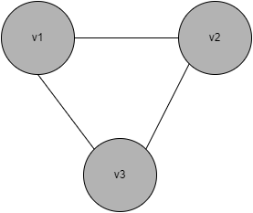
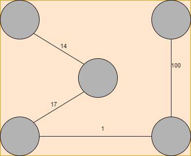
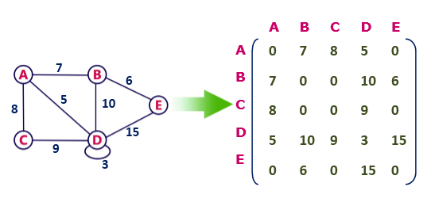
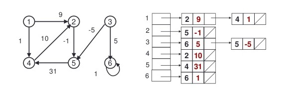
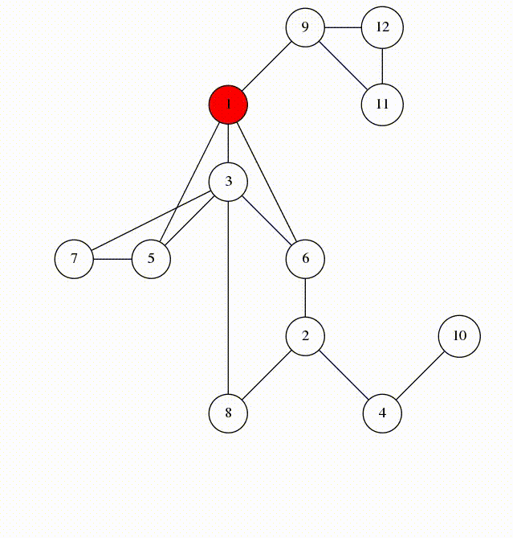

# Графи

## Определение
```
Граф е наредена двойка G = (V, E), където V e непразно множество, чиито елементи се наричат върхове. Множеството E е крайно множество от ребра. Ребро наричаме двуелементно множество {v1, v2}, където v1 и v2 са елементи на V.
```
Графите, както подсказва името, могат да бъдат изобразени "графично". Важно е да не се бърка рисунката на граф със самия граф. Един граф може да има безброй много рисунки.

Примерно, нека V = {v1, v2, v3}, E = {{v1, v2}, {v2, v3}, {v3, v1}}. Този граф може да се нарисува като:



## Видове графи

### Ориентирани и неориентирани графи
Графът, който видяхте на първия пример е неориентиран. Когато говорим за граф, и не поясним дали е ориентиран или не, става въпрос за неориентиран граф. Понякога е удобно да различаваме дали реброто e от v към u или от u към v. За ребрата на ориентирания граф вече може да си мислим не като за двуелементни множества от върхове а за **наредени двойки от върхове**. 

```
Припомняне:
Когато имаме двуелементно множество {v1, v2} е вярно, че {v1, v2} = {v2, v1}. При наредените двойки това не е вярно. За v1 != v2 имаме (v1, v2) != (v2, v1).
Наредената двойка (a, b) e множеството {{a}, {a, b}}. Да твърдим, че (a, b) = (b, a) e същото като да твърдим, че {{a}, {a, b}} = {{b}, {a, b}}. Това става единствено когато a = b.
```

Сега, разглеждаме ребрата на графа като наредени двойки. 
Нека V = {v1, v2, v3} и E = {(v1, v2), (v2, v3), (v2, v1)}.
Този граф би изглеждал така:


### Тегловен граф
Често е полезно да "закачим" някакви тегла на ребрата. Примерно, ако върходете на графа представляват някакви забележителности, а ребрата са пътища между тях, теглата могат да представляват времето в минути, което отнема да стигнем от v1 до v2. 

Примерно, това е **рисунка** на тегловен граф:




Можем да имаме и тегловни ориентирани графи.


.png)

### Мултиграфи
Неформално, в мултиграфа позволяваме да има много ребра с краища едни и същи два върха. Отново може да имаме тегловни и нетегловни мултиграфи. Може да имаме ориентирани и неориентирани мулти графи, нищо не ни спира.

## Дефиниции
| Понятие                        | Дефиниция 
| :---                           |    :----:   
| Примка в граф                  | Ребро от типа {v, v}
| Път в граф                     | Редица от върхове (v_1, v_2, ..., v_n) за които е в сила {v_i, v_{i+1}} е елемент на E.
| Цикъл в граф                   | Път **p** за който v_1 = v_n се нарича цикъл. 
| Прост път                      | Път **p** e прост ако всички елементи в редицата са уникални.
| Дължина на път                 | Дължината на пътя е **броя на ребрата в него**.
| Ацикличен граф                 | Граф, в който няма цикъл. Ако в графът има цикъл то той се нарича цикличен.
| Свързан граф                   | Граф е свързан ако за всеки два върха u, v има път между u и v.
| Силно свързани върхове         | В **ориентиран граф** казваме, че върхове u, v са силно свързани ако съществува път от u до v и от v до u
| Силно свързан граф             | Силно свързан граф е **ориентиран** граф, за който всеки два върха са силно свързани.

# Основни операции върху графи:
Графите (като абстрактен тип данни) трябва да поддържат (част) от следните операции:  

- **addVertex** - добавяне на нов връх
- **removeVertex** - премахване на връх 
- **addEdge** - добавяне на ново ребро 
- **removeEdge** - премахване на ребро
- **getSuccessors** - взимане на наследниците на връх (при ориентирани графи)
- **getPredecessors** - взимане на предшествениците на връх (при ориентирани графи)
- **adjacent** - взимане на съседните върхове на даден връх (при неориентирани графи)

# Представяне на графи
Графите намират огромно приложение в програмирането. Ако обаче започнем да представяме граф като множество от върхове и второ множество от двуелементни множества, това представяне би било бавно. 

Ние искаме да решаваме задачи върху графи с компютър. Представете си, че върховете на графа са именувани с етикети от 0 до |V| - 1. 

Наистина, няма значение как именуваме върховете, дали ще е {0, 1..., |V| - 1} дали ще е {v1, v2...} просто имаме нужда от начин, по който да се обръщаме към тях. 

## Матрици на съседство
Нека си представим булева матрица |V|x|V|. Разбрахме, се че имената на върховете са между 0 и |V| - 1. Ако има ребро между v и u то в нашата матрица това ще отбелязваме с true. Ако няма ребро го отбелязваме с false.

Нека разгледаме матрицата:
```
{
    {0, 1, 1},
    {1, 0, 1},
    {1, 1, 0}
}
```
Това е точно матрицата, която представя графът от пример 1, ако си мислим за v1 = 0, v2 = 1, v3 = 2.

Ако матрицата представя неориентиран граф, то тя е симетрична спрямо главния диагонал.

Ако матрицата представя ориентиран граф и примерно имаме ребро от 5 към 7, но не и от 7 към 5, ще е вярно, че 

```
matrix[5][7] = true
matrix[7][5] = false
```

Можем да представяме тегловни графи чрез матрица на съседство. Тази матрица вече няма да е булева понеже ще искаме да записваме някъде теглата на ребрата. 

Може да направим матрица от тип int, в която ако matrix[i][j] = 0 нямаме ребро между i и j а в противен случай стойността на matrix[i][j] e теглото на реброто започващо от i и завършващо в j. 

Но какво става ако искаме да имаме ребра с тежест 0? Тогава трябва да изберем друга стойност, която да ни представя липсата на ребро, примерно INT_MIN или INT_MAX.

Предимствата на това представяне са, че можем да проверим, дали има ребро от който и да е връх до който и да е връх за константно време. Също така за линейно време за някой възел можем да вземем всички негови съседни ребра. 

Проблемът е, че често това представяне заема твърде много памет (O(|V|^2)). Ако графът има твърде много върхове а твърде малко ребра, матрицата ще има много нули (така наречената разредена матрица). Така ще ни се наложи да представяме малко информация с много памет.

|Операция|Сложност||
|--|--|--|
|addVertex|O(n)||
|removeVertex|O(n)||
|addEdge|O(1)|
|removeEdge|O(1)|
|getSuccessors|O(n)||
|getPredecessors|O(n)||



* Тук може да си мислите за A = 0, B = 1 и тн.

## Списък от списъци
Друг начин е да държим някакъв списък (или масив) от |V| списъка. Вярно е, че списъкът на позиция i съдържа всички наследници на връх i.

Примерно, графът от пример 1 ще се представи по следния начин:

```
0: 1 -> 2
1: 0 -> 2
2: 1 -> 2
```

Сега, ако искам да видя дали има ребро между връх i и връх j това е еквивалентно на lists[i].contains(j);

Тегловни графи можем да представим, като вече списъците не са от числа а от двойки (Връх, Тегло).



* Отново, тук индексацията започва от 1. Без никакъв проблем можем да я направим да започва от 0.

Предимството на тази реализация е, че бързо можем да добавяме върхове и ребра. Също така паметта ни вече не е O(|V|^2) а O(|V| + |E|).

Част от материалите са взаимствани от [тук](https://github.com/MariaGrozdeva/Data_structures_and_algorithms_FMI/tree/main/Sem_10)

## BFS
Breadth-first search е сравнително прост алгоритъм за търсене в граф, но върху идеята, която той носи се базират други алгоритми върху графи. Примерно, алгоритъмът на Прим за минимално покриващо дърво, алгоритъмът на Dijkstra за най - къси пътища се базират на идеи подобни на тази на BFS.

Като вход получаваме граф G = (V, E) и връх s BFS систематично открива всички върхове, които са достижими от s. Чрез него можем да изчислим разстоянието (най - малкия брой ребра) от s до всеки друг връх. Алгоритъма работи за ориентирани и неориентирани графи. 

BFS използва структурата от данни опашка за да работи коректно. Самата идея е следната. Имаме начален връх, той ще бъде първия посетен. Добри кандидати да бъдат посетени след това са неговите съседи. Имаме функция adjacent (за ориентирани графи successors), та знаем кои са те. Добавяме ги в опашката, където чакат да бъдат посетени. След това последователно ги изваждаме от нея, и отново слагаме всички техни непосетени съседи в опашката, където чакат да бъдат посетени.

Трябва ни обаче някакъв начин чрез който да разбираме дали даден връх е бил посетен. Ако нямаме тази информация зацикляме. С този проблем лесно се справяме правейки масив в който записваме дали даден връх е посетен или не.

```
BFS(G = (V, E), s начален връх) 
    Създай опашка q и добави s вътре.
    Създай булев масив visited[0..|V| - 1] със стойности false.

    q.push(s).

    while(!q.empty())
        Нека cVertex е q.top().
        q.pop().
        Посети cVertex.
        Добави в q всеки съсед на cVertex, който не е посетен.
```

Ако графът не е тегловен BFS може да се използва за намирането на най - къс път между два върха. Припомнете си задача втора от трети семинар и решението ѝ. Задача първа също използва идея, подобна на бфс.

## DFS
BFS обхожда графа ниво по ниво. DFS използва различна стратегия, наподобяваща обхождането на лабиринт. Вървим по път докато не "стигнем до края на този път" (нямаме накъде да отидем повече). След това се връщаме назад, докато не стигнем връх, който има непосетен съсед. Рекурсивно повтаряме тази стратегия върху непосетения съсед и внимаваме да не повторим връх два пъти.



DFS използва структурата от данни stack за да работи коректно. Важно е да се отбележи, че замяната на опашката със стек в DFS алгоритъма **не влече** кректен DFS. За наше улеснение ще направим функцията рекурсивна и ще използваме системния стек. 

На примера виждаме едно DFS обхождане на граф. 

Може да видите, че след като обхождането приключи, ребрата, които използваме да посетим връх за пръв път образуват дърво. Това до някаква степен е очаквано, DFS не повтаря върхове и открива всички върхове достижими от началния, тоест графа, който ще е обходен ще е свързан. 

DFS посещава всеки връх и всяко ребро точно един път, което води до сложност O(|V| + |E|).

DFS има много приложения, използва се за намиране на цикъл в граф, топологично сортиране на DAG (directet acyclic graph), търсене на пътища и др.

Във файла DFS-Additional има интересни/допълнителни неща около DFS.