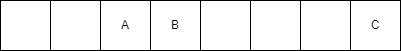

# Абстрактен тип данни речник. Хеш таблици.

*A common problem in computer science is the representation of a mapping between two sets.*

## Dictionary problem
Нека си представим абстрактен тип данни, който поддържа някакво множество от елементи, всеки от който има ключ. Искаме да поддържаме следните операции:
* insert(item) - добави елемента в колекцията
* delete(item) - премахни елемента от колекцията 
* search(key)  - дай ми елемента, чийто ключ е key ако съществува такъв.

Предполагаме, че всички елементи имат различни ключове.
Този абстрактен тип данни наричаме dictionary.

Балансирано дърво за търсене би решило проблема със сложност O(log(n)) за всяка от трите операции.

Целта за днес: O(1) за тези три операции.

```
The dictionary problem is the classic problem of designing efficient data structures that implement associative arrays. The two major solutions to the dictionary problem are hash tables and search trees.
```

## Мотивация зад структурата
Речниците са **най - популярната** нетривиална структура от данни в компютърните науки. Причината е, че много проблеми от реалния свят могат ефикасно да се решат с речници.

## Интуиция
Цял семестър сме си водили старателно записки по всички предмети и сега изпитите наближават. Това предполага много четене, разбира се от записките, които старателно сме водили цял семестър. Ясно е, че често ще ни се налага да търсим записки от определена лекция. 

Слагаме всички записки на куп, без никаква наредба. Сега, за да намерим записките от третата лекция по структури от данни ще ни се наложи да претърсим целия куп от лекции. Никой обаче не учи по един предмет цял ден, вероятно след 3 часа учене по структури от данни ни се иска да прочетем нещо по функционално програмиране и сега пак претърсваме целия куп.

Отиваме до Икеа и си купуваме 6 кутии. Правим логичното нещо - слагаме записките по структури от данни в първата, тези по функционално във втората и тнт.

Сега, ако ни се наложи да търсим записки по определен предмет вече няма да се налага да изровим целия куп с листи а само кутията в която се намират те.

## Хеш функции
Интуитивно хеш таблиците ще са просто множество от кутии (или както се наричат в практиката buckets(кофи)). За реализацията на хеш таблици използваме хеш функции, които при додаден ключ генерират индекс (хеш код), на който трябва да се запише съответната стойност.

Това звучи страхотно, но по принципа на Дирихле ако имаме повече елементи за слагане в кофите отколкото кофи ще се наложи да сложим поне два елемента в една кофа. Това на практика става и преди да елементите да станат повече от кофите. Нека *X* и *Y* са два различни ключа. Абсолютно възможно е 

```
h(X) = h(Y)
```
и това наричаме *колизия*. От тук можем да си направим два извода. Първо, хеш функцията **не е обратима** и второ ще трябва да измислим някакъв начин да се справим с тези колизии.

Какво наричаме добра хеш функция?
* Функцията трябва да използва всички данни от ключа.
* Функцията равномерно да разпределя елементите.
* Функцията трябва да е бърза за изчисляване.
* Желателно е за подобни ключове функцията да връща различни резултати.

Примерно
```cpp
int hashDummy(int key) {
    return 0;
}
```
е валидна хеш функция. Е, не е особено добра. Не е изобщо добра.

Какво наричаме перфектна хеш функция? Няма такава. Добрата хеш функция се държи добре върху определен вход, но няма универсална хеш функция. Намирането на добра хеш функция може да изисква голямо задълбочено разбиране в някои математически дисциплини.

## Справяне с колизии - Separate chaining
Нека си мислим за кофите като за свързани списъци.
За всеки елемент, индексът на свързания списък, в който трябва да го добавим се определя от хеш функцията.

```cpp
int index(const Key& k) {
    return hash(key) % table.size();    // Ако не правим модулно делене рискуваме да излезем от рамките на таблицата.
}
```

Сега наивно, добавянето може да изглежда по следния начин:
```cpp
void insert(const Key& k, const Value& v) {
    size_t idx = index(k);

    table[idx].push_back({k, v});
}
```
Проблем: какво правим когато ключът вече съществува? Ако оставим кода така ще имаме списък с два ключа, имащи различни стойности. 
Полезно е да имаме функционалност, която ъпдейтва стойността на ключа. Правим следното:

```cpp
void insert(const Key& k, const Value& v) {
    size_t idx = index(k);

    for(auto& elementInBucket : table[idx]) {
        if(elementInBucket.key == k) {
            elementInBucket.value = v; // update key
            return;
        }
    }

    table[idx].push_back({k, v});
}
```

Страхотно, сега търсенето ни се свежда до търсене в списък:
```cpp
Value getValue(const Key& k) {
    size_t idx = index(k);

    for(const auto& elementInBucket : table[idx]) {
        if(elementInBucket.key == k) {
            return elementInBucket.value;
        }
    }
    // Съобщение за грешка. Може да не е ексепшън, вие решавате.
    throw std::exception("Key not found!");
}
```

Също така, премахването на елемент отново ни се свежда до премахване на елемент от списък.
```cpp
void eraseKey(const Key& k) {
    size_t idx = index(k);

    for(const auto& elementInBucket : table[idx]) {
        if(elementInBucket.key == k) {
            return elementInBucket.value;
        }
    }
    // Съобщение за грешка. Може да не е ексепшън, вие решавате.
    throw std::exception("Key not found!");
}
```

Какво правим обаче когато елементите в колекцията станат много? Ясно е, че ако имаме 10 кофи и 1000 елемента нещата няма да са толкова ефикасни. Можем да преоразмеряваме таблицата. Колкото повече елементи имаме в колекцията толкова по - голяма таблица ще правим.

Преоразмеряването ще стане сравнително лесно - вече знаем как да добавяме елемент и как реализираме контейнера. Просто създаваме два пъти по - голям контейнер и добавяме всички елементи в него по познатия начин.

Въпросът сега е кога ще преоразмеряваме? Нека n = броя на елементите, m = броя на кофите.
```
LoadFactor = n / m.
```
Ясно е, че когато m = n следващото добавяне ще гарантира, че ще има поне една кофа с два елемента. Реално кофата с повече от един елемент се появява доста по - рано.

Преоразмеряването на таблицата се прави при LoadFactor = 0,7 (Когато елементите станат 70 процента от кофите). Така, жертвайки малко повече памет, постигаме бързо търсене.

## Какво друго жертваме?
При хешовете нямаме наредба на елементите. Разбира се, можем да ги обходим, но това обхождане не гарантира нищо. Дърветата от друга страна са познати с това, че поддържат колекцията сортирана. Това понякога е полезно, но в някои случаи не ни интересува да имаме сортирана колекция.

Сложността в най - лошия случай тук е O(n). Това става когато имаме лоша хешираща функция. Ако хеширащата ни функция се държи добре (разпределя равномерно информацията между кофите) очакваната сложност е O(1).

```
Although searching for an element in a hash table can take as long as searching for an element in a
linked list — Theta(n) time in the worst case — in practice, hashing performs extremely
well. Under reasonable assumptions, the average time to search for an element in
a hash table is O(1).
```

## Използване на други структури за да подобрим O(n) worst case
Лошата горна граница за търсенето ни идва от факта, че използваме свързани списъци. Вече имаме дървета, които ни позволяват O(log(n)) търсене, защо вместо свързани списъци не използваме тях примерно?

Това е интересна тема за разсъждение - от една страна лошото търсене не се дължи толкова на свързания списък колкото на факта, че елементите не са разпределени добре. Дървото ще забърза нещата, но така не поддържаме ли просто едно бавно дърво (или няколко такива)?

От друга страна съм чувал, че такива техники се използват. [Тук](https://openjdk.org/jeps/180) прочитаме:

```
The principal idea is that once the number of items in a hash bucket grows beyond a certain threshold, that bucket will switch from using a linked list of entries to a balanced tree. In the case of high hash collisions, this will improve worst-case performance from O(n) to O(log n).
```
та тази идея явно не е толкова неизползваема. 

## Недостатъци на Separate chaining 
Оказва се, че сложността в лошия случай не е най - големия проблем. За да разберем проблема трябва да разберем какво е cache locality.
Темата е много интересна, но не се събира в ограниченото време което имаме.
[Тук](https://www.youtube.com/watch?v=kcdaiPb7vaY) може да се запознаете подробно с темата.

Сбито казано: когато четем памет, компютъра предполага, че съседните клетки може би скоро също ще трябва да бъдат прочетени. Затова ги записва в по - малка памет, която обаче е по - бърза.

Това е и причината итерацията на масив да е в пъти по - бърза от итерацията на свързан списък. Елементите на свързания списък са разпръснати в паметта (намирахме ги с указатели) и често ни се налага да четем нова и нова памет.

Когато прочетем клетка, която е записана в кеш паметта е cache hit. Когато ни се наложи да се разходим по - дълго за да намерим клетката която ни трябва това се нарича cache miss. 

Дори когато имаме два елемента в кофата ще направим два cache miss-a.

## Open adressing
В предишната стратегия елементите се държаха извън хеш таблицата. В отвореното адресиране **всички** елементи се държат в хеш таблицата. Този подход също се нарича затворено хеширане.

Сега въпросът е как реализираме абстрактните операции? Има няколко начина.

## Linear probing
Нека започнем да разсъждаваме и да видим какви проблеми ще срещнем.

### Добавяне
Разглеждаме елементите и техните хеш кодове: {A, 2}, {B, 3}, {C, 7}, {D, 2}.

Добавянето на първите три в някакъв смисъл е лесно. Имаме следния сценарий:



Какво правим обаче когато имаме колизия (както е в случая с D). Ами започваме линейно да търсим първата свободна клетка. Там добавяме D.


## Търсене
Сега, да предположим, че търсим D. Генерираме неговия хеш код, но на негово място стои А. Логично е, познавайки стратегията си, да не се отказваме и да продължим да търсим. Търсим до момента в който не срещнем първата празна клетка.

## Изтриване
Тук нещата стават малко по - сложни. Да кажем, че изтрием С. След това търсим D. Но сега между A и D има празна клетка. Трябва да направим някаква модификация за да се справим с този проблем.

Решение: добавяме два флага на клетката: empty и deleted. Ако клетката е била изтрита **не спираме да търсим**. Спираме при първата **празна клетка**. Няма проблем да добавяме елементи в изтрита клетка.

Тук преоразмеряването е задължително. Отново, когато елементите станат около 70 процента преоразмеряваме.

## std::unordered_map. std::unordered_set.

## Тестове

## Задача първа
Даден ни е някакъв стринг. Искаме да го разделим на подстрингове от последователни елементи така, че всеки елемент в тези подстрингове да е уникален. Да се върне колко най - малко такива подстрингове трябва да имаме.

Пример: abacaba => "a","ba","cab","a" (връщаме 4)